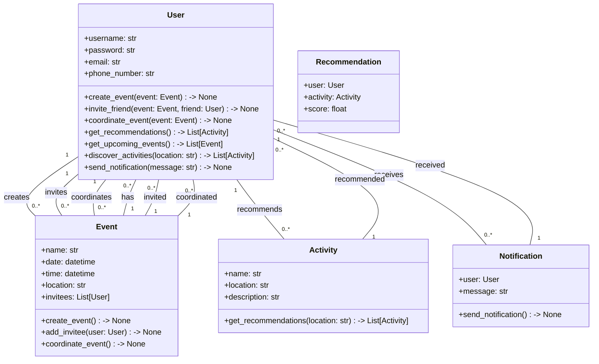
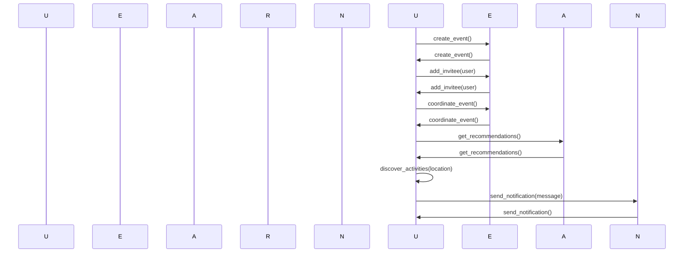

## Implementation approach:
To implement the social life management app, we will use the Django web framework for the backend and React for the frontend. Django provides a robust and scalable architecture for building web applications, while React offers a modern and efficient user interface.

For personalized recommendations, we can leverage machine learning algorithms and libraries such as scikit-learn or TensorFlow. These libraries provide powerful tools for building recommendation systems based on user preferences and location.

To handle event invitations and coordination, we can integrate with popular messaging platforms like Twilio or SendGrid. These platforms offer APIs for sending SMS or email notifications to users and their friends.

For discovering new activities and events, we can utilize APIs from services like Meetup, Eventbrite, or Foursquare. These APIs provide access to a wide range of events and activities based on location and user preferences.

To ensure a user-friendly experience, we will focus on responsive design principles and use CSS frameworks like Bootstrap or Material-UI. These frameworks provide pre-built components and styles that can be easily customized to create a visually appealing and intuitive interface.

For reminders and notifications, we can use push notification services like Firebase Cloud Messaging or OneSignal. These services allow us to send real-time notifications to users' devices.

## Python package name:
```python
"social_life_manager"
```

## File list:
```python
[
    "main.py",
    "models.py",
    "views.py",
    "urls.py",
    "serializers.py",
    "recommendation.py",
    "messaging.py",
    "discovery.py",
    "notifications.py",
    "templates/",
    "static/",
    "frontend/",
    "requirements.txt"
]
```

## Data structures and interface definitions:


## Program call flow:


## Anything UNCLEAR:
The requirement is clear to me.